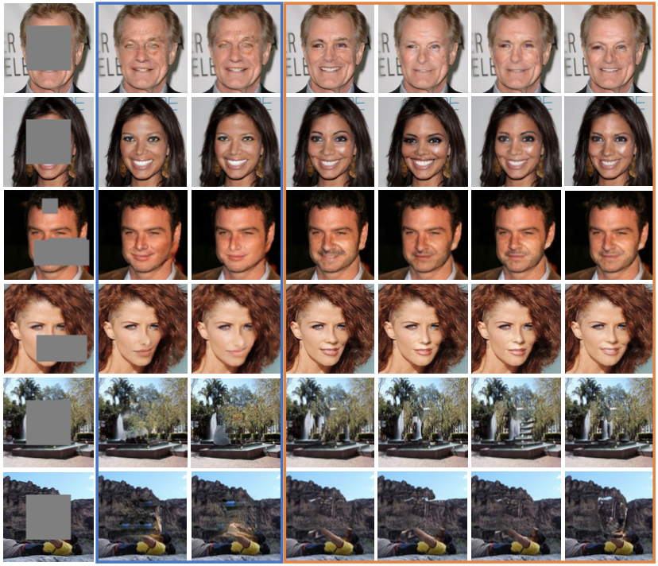
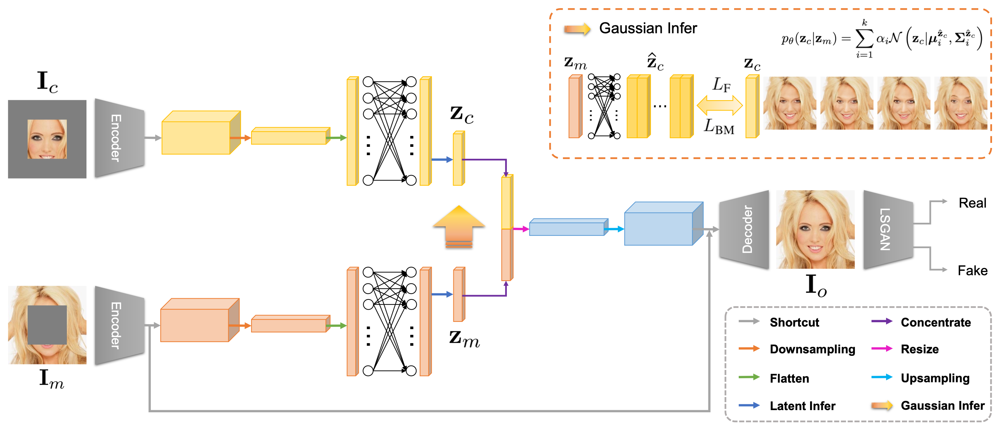

# Pluralistic Image Completion with Gaussian Mixture Models (PICMM)



### [Paper](https://openreview.net/pdf?id=wuunqp9KVw) 

**This repository is the official pytorch implementation of our NeurIPS 2022 paper, *Pluralistic Image Completion with Gaussian Mixture Models*.**

Xiaobo Xia<sup>1\*</sup>, Wenhao Yang<sup>2\*</sup>, Jie Ren<sup>3</sup>, Yewen Li<sup>4</sup>, Yibing Zhan<sup>5</sup>, Bo Han<sup>6</sup>, Tongliang Liu<sup>1</sup> <br>
<sup>1</sup>The University of Sydney, <sup>2</sup>Nanjing University, <sup>3</sup>The University of Edinburgh, <sup>4</sup>Nanyang Technological University, <sup>5</sup>JD Explore Academy, <sup>6</sup>Hong Kong Baptist University <br>
\* Equal contributions


## Prerequisites

- Python >=3.7
- NVIDIA GPU + CUDA cuDNN
```bash
pip install -r requirements.txt
```


## Pipeline




## Training

```
python train.py --name [exp_name] \
                --k [numbers_of_distributions] \
                --img_file [training_image_path]
```

Notes of training process: 
+ Our code supports 


## Inference

```
python test.py --name [exp_name] \
               --k [numbers_of_distributions] \
               --which_iter [which_iterations_to_load] \
               --img_file [training_image_path] \
               --sample_num [number_of_diverse_results_to_sample]
```

Notes of inference: 
+ `--sample_num`: How many completion results do you want?


## Citation

If you find our work useful for your research, please consider citing the following papers :)

```bibtex
@inproceedings{xia2022pluralistic,
  title={Pluralistic Image Completion with Gaussian Mixture Models},
  author={Xia, Xiaobo and Yang, Wenhao and Ren, Jie and Li, Yewen and Zhan, Yibing and Han, Bo and Liu, Tongliang},
  booktitle={NeurIPS},
  year={2022}
}
```


## Acknowledgments

*The authors would give special thanks to Mingrui Zhu (Xidian University), Zihan Ding (Princeton University), and Chenlai Qian (Southeast University) for helpful discussions and comments.* 


## Contact

This repo is currently maintained by Xiaobo Xia and Wenhao Yang, which is only for academic research use. If you have any problems about the implementation of our code, feel free to contact wenhaoyang.alpha@gmail.com. Discussions and questions about our paper are welcome via xiaoboxia.uni@gmail.com. 
